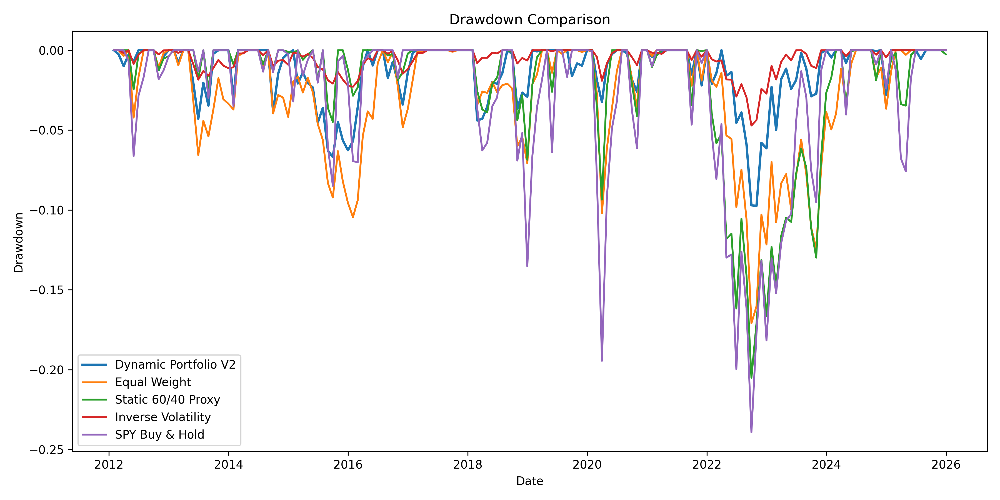

# Adaptive Portfolio Project V2

## Institutional-Grade Regime-Aware Multi-Asset Portfolio Strategy

A quantitative portfolio management system designed to dynamically allocate capital across asset classes based on changing market conditions.

This project combines:

- Market regime detection  
- Momentum tilts  
- Trend filters  
- Volatility targeting  
- Dynamic rebalancing  
- Multi-asset diversification  
- Risk-adjusted performance optimization  

Instead of relying on static allocations like the traditional 60/40 model, this framework adapts exposure across growth, defensive, and stress environments.

---

# Executive Summary

Financial markets are not static.

Correlations shift. Volatility clusters. Crises emerge. Bull markets accelerate.

Traditional portfolios often fail to adapt quickly enough.

This project was built to solve that problem through an adaptive investment framework that changes portfolio weights based on evolving market regimes.

---

# Key Backtest Results

## Dynamic Portfolio V2

| Metric | Result |
|-------|-------:|
| CAGR | **12.01%** |
| Annualized Volatility | **7.56%** |
| Sharpe Ratio | **1.28** |
| Sortino Ratio | **2.44** |
| Max Drawdown | **-9.75%** |
| Calmar Ratio | **1.23** |
| Hit Rate | **67.86%** |

---

# Benchmark Comparison

| Strategy | CAGR | Sharpe | Max Drawdown |
|---------|------:|------:|-------------:|
| Dynamic Portfolio V2 | **12.01%** | **1.28** | **-9.75%** |
| Equal Weight | 5.55% | 0.46 | -17.10% |
| Static 60/40 | 9.60% | 0.86 | -20.51% |
| SPY Buy & Hold | 14.86% | 0.93 | -23.93% |

---

# Why This Matters

The strategy generated:

- Strong double-digit returns  
- Excellent Sharpe ratio  
- Low drawdowns  
- Better downside control than passive equity exposure  
- Better risk-adjusted performance than static benchmarks  

This demonstrates how adaptive allocation can improve portfolio efficiency.

---

# Strategy Architecture

## 1. Regime Detection

Markets are classified into four states:

- Calm Growth  
- Volatile Growth  
- Defensive / Uncertain  
- Crisis / Stress  

This allows the model to react differently depending on market behavior.

---

## 2. Allocation Engine

Portfolio weights shift dynamically depending on regime:

### Calm Growth
Higher exposure to risk assets.

### Volatile Growth
Balanced participation with moderated risk.

### Defensive / Uncertain
Reduced concentration, broader diversification.

### Crisis / Stress
Capital preservation through defensive assets and cash bias.

---

## 3. Tactical Overlay

Additional signals include:

- Relative momentum  
- Trend confirmation  
- Volatility scaling  
- Weight smoothing  

---

# Portfolio Universe

Example asset universe includes:

- US Equities  
- Long-Term Bonds  
- Gold  
- Emerging Markets  
- Real Estate  
- Commodities  

---

# Generated Outputs

The system automatically exports:

## Performance Files

- `outputs/portfolio_results.csv`
- `outputs/benchmark_results.csv`
- `outputs/metrics.csv`

## Charts

- Growth of $1
- Drawdown Comparison
- Rolling Sharpe Ratio
- Regime Timeline
- Portfolio Weights Through Time
- Regime-Colored Growth Chart
- Yearly Allocation Labels

---

# Example Charts

## Growth of $1

```text
outputs/charts/01_growth_of_1.png


## Drawdown Comparison

This chart shows the percentage decline of each portfolio from its previous peak over time. Lower and shallower drawdowns indicate better downside protection.



